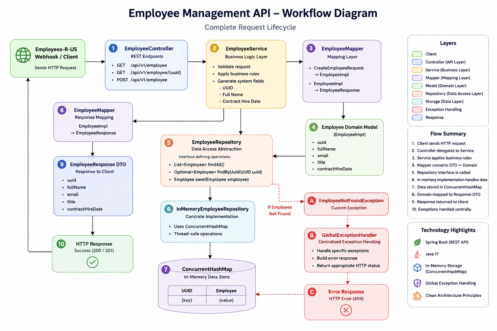

# ReliaQuest's Entry-Level Java Challenge

Please keep the following in mind while working on this challenge:
* Code implementations will not be graded for **correctness** but rather on practicality
* Articulate clear and concise design methodologies, if necessary
* Use clean coding etiquette
  * E.g. avoid liberal use of new-lines, odd variable and method names, random indentation, etc...
* Test cases are not required

## Problem Statement

Your employer has recently purchased a license to top-tier SaaS platform, Employees-R-US, to off-load all employee management responsibilities.
Unfortunately, your company's product has an existing employee management solution that is tightly coupled to other services and therefore 
cannot be replaced whole-cloth. Product and Development leads in your department have decided it would be best to interface
the existing employee management solution with the commercial offering from Employees-R-US for the time being until all employees can be
migrated to the new SaaS platform.

Your ask is to expose employee information as a protected, secure REST API for consumption by Employees-R-US web hooks.
The initial REST API will consist of 3 endpoints, listed in the following section. If for any reason the implementation 
of an endpoint is problematic, the team lead will accept **pseudo-code** and a pertinent description (e.g. java-doc) of intent.

Good luck!

## Endpoints to implement (API module)

_See `com.challenge.api.controller.EmployeeController` for details._

getAllEmployees()

    output - list of employees
    description - this should return all employees, unfiltered

getEmployeeByUuid(...)

    path variable - employee UUID
    output - employee
    description - this should return a single employee based on the provided employee UUID

createEmployee(...)

    request body - attributes necessary to create an employee
    output - employee
    description - this should return a single employee, if created, otherwise error

## Code Formatting

This project utilizes Gradle plugin [Diffplug Spotless](https://github.com/diffplug/spotless/tree/main/plugin-gradle) to enforce format
and style guidelines with every build.

To format code according to style guidelines, you can run **spotlessApply** task.
`./gradlew spotlessApply`

The spotless plugin will also execute check-and-validation tasks as part of the gradle **build** task.
`./gradlew build`



# Project Structure

The project follows a layered architecture where each layer has a specific responsibility. This keeps the code organized, easier to understand, and easier to maintain.

```text
com.challenge.api
│
├── controller      // Handles REST API requests
├── dto             // Request and response objects
│   ├── request
│   └── response
├── exception       // Custom exceptions and global exception handling
├── mapper          // Converts DTOs and domain objects
├── model           // Employee model
├── repository      // Stores and retrieves employee data
├── service         // Contains business logic
├── util            // Generates mock employee data
└── EntryLevelJavaChallengeApplication
```

# Design Decisions

### Layered Architecture

The application is organized into Controller, Service, Repository, and Mapper layers so that each layer has a single responsibility. This makes the project easier to understand and maintain.

### Repository Pattern

The assignment did not require a database, so I used an in-memory repository. I still created a repository interface so that a database can be added later without changing the service layer.

### In-Memory Storage

Employee records are stored using `ConcurrentHashMap<UUID, Employee>`. It provides fast lookups, is thread-safe, and meets the assignment requirement of not using a database.

### DTOs

Separate request and response DTOs are used so that clients only send and receive the required data. System-generated fields like UUID and contract dates are managed by the application.

### Mapper

A separate mapper is used to convert between DTOs and domain models. This keeps the controller and service classes clean and focused on their responsibilities.

### Dependency Injection

Constructor injection is used throughout the project because it makes dependencies clear, allows fields to be `final`, and makes the code easier to test compared to field injection (`@Autowired`).

# Assumptions

- The assignment does not require a database, so employee data is stored in memory.
- Mock employee data is loaded when the application starts.
- UUID and contract dates are generated by the application.

# Future Enhancements

If this project is extended further, the following improvements can be added:

- Replace the in-memory repository with a database like MySQL or PostgreSQL.
- Add request validation using Bean Validation (`@Valid`, `@NotBlank`, `@Email`, etc.).
- Write unit and integration tests using JUnit and Mockito.
- Secure the APIs using Spring Security and JWT authentication.
- Add logging and monitoring for better debugging and application health.
- Generate API documentation using Swagger/OpenAPI.
- A future enhancement would be to add an Adapter layer to support legacy systems that expose employee data in XML, SOAP, or other custom formats.